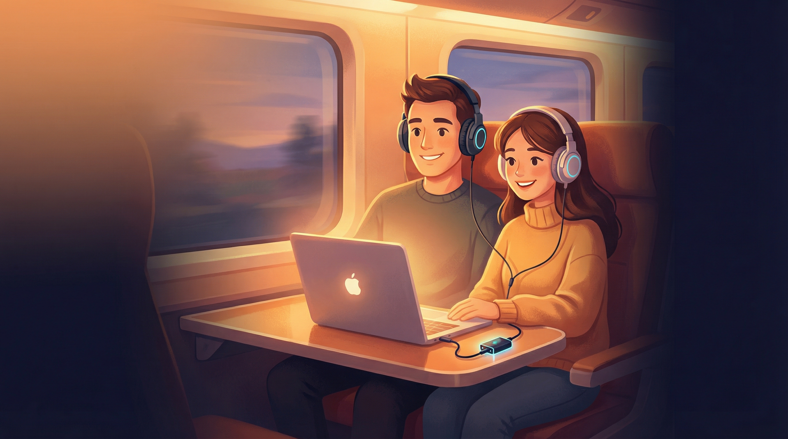

  

<h1 align="center">Double Headphones</h1>

  <strong>Share audio to multiple headphones simultaneously on Windows</strong> 
  No drivers. No complexity. Just click and listen.

  
  &nbsp;
  
  &nbsp;
  

---

## The Problem

You're on a train with your partner. You want to watch a movie together on your laptop. But Windows only plays audio through **one device at a time**.

Your options? Share one pair of earbuds (uncomfortable). Use a splitter cable (who carries those?). Let one person use the laptop speaker (everyone on the train hates you).

## The Solution

**Double Headphones** captures your system audio and routes it to two or more output devices at the same time. Bluetooth, wired, USB — any combination works.

1. Connect both headphones
2. Select them in the app
3. Click **Share Audio**
4. Both headphones play the same audio, in sync

That's it. When you stop sharing, everything goes back to normal automatically.

## Features

- **Multi-device output** — play audio on 2+ devices simultaneously
- **No drivers required** — pure Windows APIs, nothing to install
- **Dead simple** — three dropdowns and one button
- **Any headphones** — Bluetooth, wired, USB DACs, speakers, any mix
- **Per-device volume** — adjust each output independently
- **Latency compensation** — sync Bluetooth with video using the slider
- **Crash-safe** — if the app crashes, your audio restores automatically
- **System tray** — minimize and forget about it
- **Lightweight** — under 5% CPU
- **Free forever** — no ads, no telemetry, no tracking, no trial

## Download

**[Download DoubleHeadphones.exe](https://github.com/maayaranai/double-headphones/releases/latest)** (Windows 10/11, 64-bit)

Single portable .exe — no installation needed. Just download and run.

## On a Mac?

Double Headphones is Windows-only, but macOS can do this natively with a built-in
**Multi-Output Device** — no download required. Follow the free step-by-step
**[Mac guide](docs/mac.md)**.

## System Requirements

| | Minimum |
|---|---|
| **OS** | Windows 10 (build 20348+) or Windows 11 |
| **Arch** | 64-bit (x64) |
| **Audio** | Two or more output devices connected |

## FAQ

<strong>Why do I hear faint audio from my laptop speakers?</strong>

 
The app lowers the source volume to near-zero on the default device to keep the audio pipeline alive. It's effectively inaudible. Mute your laptop speakers for complete silence — you'll be listening through headphones anyway.

<strong>Netflix/Disney+ audio is silent</strong>

 
Streaming apps with DRM block audio capture. Use Chrome instead of the native Windows app — it works perfectly.

<strong>Audio is out of sync with video</strong>

 
Bluetooth adds 150-250ms of latency. Use the latency slider in the app, or adjust audio delay in your video player (VLC: press J/K).

<strong>Two Bluetooth headphones are stuttering</strong>

 
A single Bluetooth adapter may struggle with two streams. A second USB Bluetooth adapter (~$10) solves this completely.

<strong>Can I use more than 2 devices?</strong>

 
Yes — the architecture supports unlimited devices. The current UI shows two, with more planned.

## Known Limitations

- **DRM content** (Netflix app, Edge) — use Chrome as workaround
- **Bluetooth latency** (150-250ms) — physics, use the latency slider
- **Dual BT on single adapter** — may stutter, second USB adapter recommended
- **Windows 10 before build 20348** — required API not available

## Support Development

Double Headphones is free forever. If it saves you from sharing earbuds on your next trip, consider [buying me a coffee](https://ko-fi.com/ranmazor).

## License

Proprietary — free for personal use. See [LICENSE](LICENSE) for details.

---

Built with ♥ for couples who travel together

